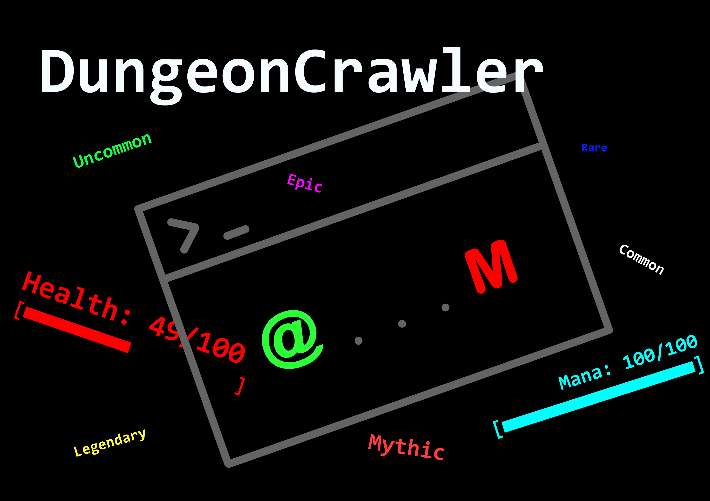

# **Dungeon Crawler: Endless Descent**

Languages: English | [Français](./infoFr.md)

Technical Specification as of 12/14/23: [English](./technicalSpecification.md) | [Français](./cahierDesCharges.md)

[Trailer](https://youtu.be/xloDiqyYOFg)

Turn based game, entirely in console

*The game needs to set the terminal in fullscreen*

## **Run the game**
### Windows: 
-   Download the latest release
-   Extract the zip file
-   Run the `DungeonCrawler-Windows.exe` file

### Linux:
-   Download the latest release
-   Extract the zip file
-   Install wine (if not already installed)
-   Run the `DungeonCrawler-Windows.exe` file

### Python:
-   Download the source code
-   Install the required packages with `pip install -r requirements.txt`
-   Run the `main.py` file

## **Concept:**

"Dungeon Crawler: Endless Descent" is an endless dungeon exploration game where players take on the role of a brave adventurer delving into the depths of a never-ending, procedurally generated dungeon. The objective is to survive as long as possible, defeating monsters, collecting loot, and descending deeper into the mysterious underground world.

## **Gameplay:**

1. **Procedurally Generated Dungeons:** The game features randomly generated dungeons with a variety of rooms, traps, puzzles, and enemies. Each descent into the dungeon is unique, offering a fresh challenge.

2. **Character Classes:** Players can choose from different character classes such as warrior, mage, archer, or rogue, each with its unique abilities and playstyle.

3. **Combat:** Engage in real-time combat with a wide range of monsters and bosses. Combat can involve melee, ranged attacks, spells, and special abilities based on the chosen class.

4. **Loot and Equipment:** Defeated enemies drop loot, including weapons, armor, potions, and magical artifacts. Players can equip these items to enhance their abilities and survivability.

5. **Resource Management:** Manage resources such as health, mana, and stamina carefully. Use healing items and mana-restoring potions strategically to survive.

6. **Leveling and Skill Trees:** Gain experience points by defeating monsters and leveling up. Invest skill points in skill trees to customize character abilities and playstyle.

**"Dungeon Crawler: Endless Descent"** offers a classic and engaging endless game experience, perfect for those who enjoy exploration, combat, and character progression in a dark and mysterious setting.

## Known Issue
-   Screen resolution must be equal to or greater than 1920x1080
-   On Windows 10, the game is sometime not automatically opening in fullscreen.
-   When showing the spell tree, since chinese characters take 2 alphanumeric character width, it will cause minor problem (windows borders and the rendering of the tree).
