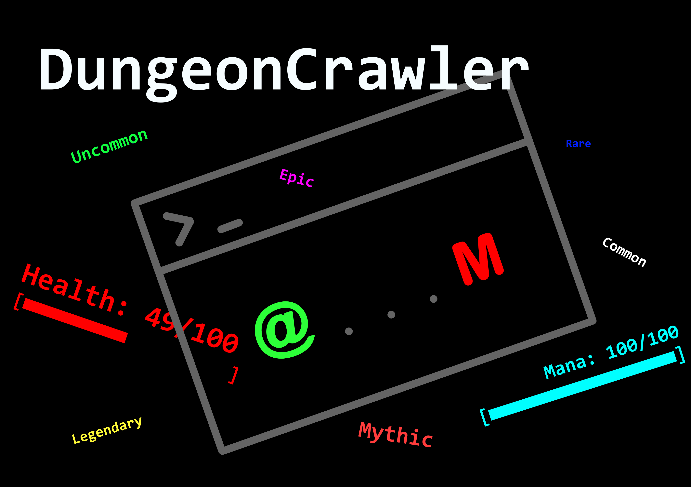

# **Dungeon Crawler: Endless Descent**

Languages: [English](./README.md) | Français

Cahier des charges au 14/12/23: [English](./technicalSpecification.md) | [Français](./cahierDesCharges.md)

[Trailer](https://youtu.be/xloDiqyYOFg)

Jeu au tour par tour, entièrement dans le terminal (peut etre en faire un jeu avec des graphismes)

*Le jeu nécessite que le terminal soit en plein écran*

## **Lancer le jeu**
### Windows:
-   Téléchargez la dernière version
-   Extrayez le fichier zip
-   Exécutez le fichier `DungeonCrawler-Windows.exe`

### Linux:
-   Téléchargez la dernière version
-   Extrayez le fichier zip
-   Installez wine (si ce n'est pas déjà fait)
-   Exécutez le fichier `DungeonCrawler-Windows.exe`

### Python:
-   Téléchargez le code source
-   Installez les paquets requis avec `pip install -r requirements.txt`
-   Exécutez le fichier `main.py`

## **Concept** :

"Dungeon Crawler: Endless Descent" est un jeu d'exploration de donjons sans fin où les joueurs endossent le rôle d'un courageux aventurier plongeant dans les profondeurs d'un donjon généré de manière procédurale, infini. L'objectif est de survivre aussi longtemps que possible, en affrontant des monstres, en collectant du butin et en descendant plus profondément dans le monde souterrain mystérieux.

## **Gameplay**:

1. **Donjons Générés de Manière Procédurale** : Le jeu propose des donjons générés aléatoirement avec une variété de salles, de pièges, d'énigmes et d'ennemis. Chaque descente dans le donjon est unique, offrant un défi frais.

2. **Combat** : Participez à des combats en temps réel contre une grande variété de monstres et de boss.

3. **Butin et Équipement** : Les ennemis vaincus laissent tomber du butin, y compris des armes, des armures, des potions et des artefacts magiques. Les joueurs peuvent équiper ces objets pour améliorer leurs capacités et leur capacité à survivre.

4. **Gestion des Ressources** : Gérez soigneusement les ressources telles que la santé, la mana et l'endurance. Utilisez stratégiquement les objets de guérison et les potions de restauration de mana pour survivre.

5. **Collecte de Ressources** : Tuez vos ennemis et récupérez des matériaux utilisable pour forger des armes et armures.

6. **Niveaux et Arbres de Compétences** : Gagnez des points d'expérience en vainquant des monstres et en montant de niveau. Investissez des points de compétence dans les arbres de compétences pour personnaliser les capacités et le style de jeu du personnage.

**"Dungeon Crawler: Endless Descent."** offre une expérience de jeu sans fin classique et captivante, parfaite pour ceux qui aiment l'exploration, le combat et la progression des personnages dans un cadre sombre et mystérieux.

## Problème Connu

**BUG QUI NE VONT PAS ETRE CORRIGES EN RAISON DE L'UTILISATION DE CURSES**

-   Lors de l'affichage de l'arbre des sorts, comme les caractères chinois prennent la largeur de 2 caractères alphanumériques, cela va engendrer des problèmes mineurs (bordures des fenêtres et affichage de l'arbre)